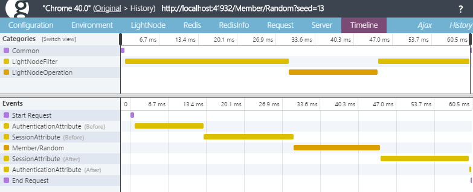
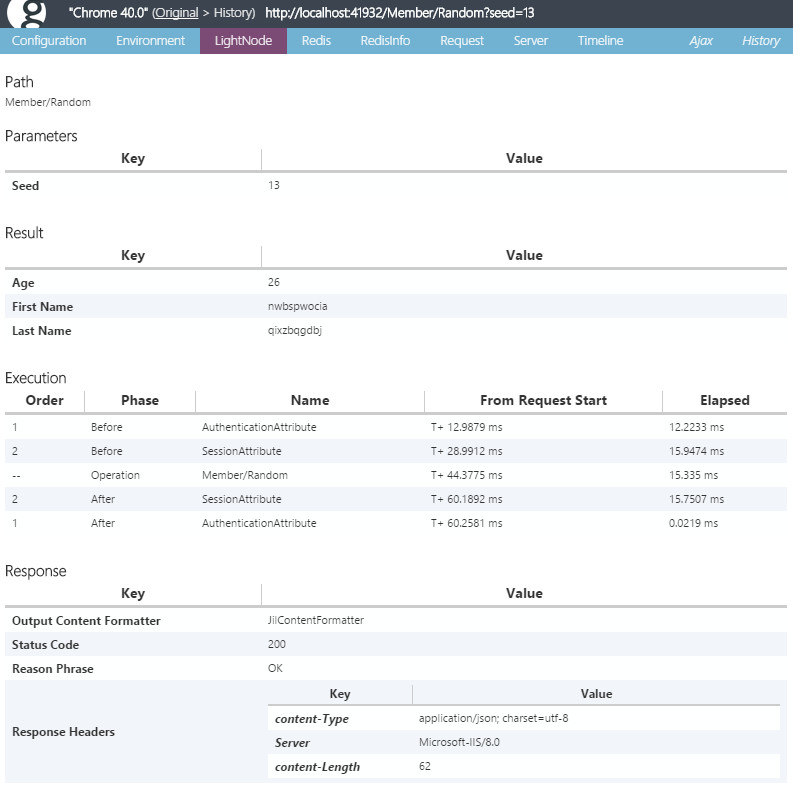
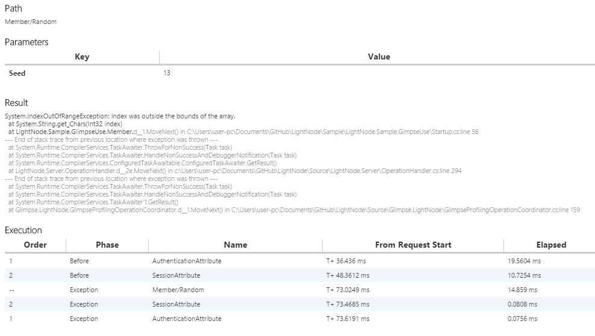
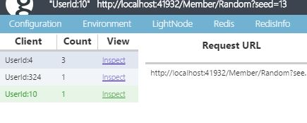

LightNode
=========
LightNode is a Micro RPC/REST Framework built on OWIN. LightNode is a good alternative to the ASP.NET Web API and Nancy if you make a simple API. It is like Ruby's [Grape](https://github.com/intridea/grape) framework. Implementation of the API is lightweight, powerful debugging supports with [Glimpse](http://getglimpse.com/), client code generation by T4 for PCL(HttpClient) and Unity3D.  

Installation
---
binary from NuGet, [LightNode.Server](https://nuget.org/packages/LightNode.Server/)

```
PM> Install-Package LightNode.Server
```

Implement Server
---
Server implementation is very easy, built up Owin and implements `LightNodeContract`.

```csharp
// Owin Startup
public class Startup
{
    public void Configuration(IAppBuilder app)
    {
        app.UseLightNode();
    }
}

// implement LightNodeContract, all public methods become API.
// You can access {ClassName}/{MethodName}
// Ex. http://localhost/My/Echo?x=test
public class My : LightNodeContract
{
    // return value is response body serialized by ContentTypeFormatter(default is JSON).    
    public string Echo(string x)
    {
        return x;
    }

    // support async! return type allows void, T, Task and Task<T>.
    // parameter supports array, nullable and optional parameter.
    public Task<int> Sum(int x, int? y, int z = 1000)
    {
        return Task.Run(() => x + y.Value + z);
    }
}
```

Compile, run, very quick! LightNode calls class as Contract, method as Operation.

> Parameter model bindings supports only basic pattern, can't use complex type. allow types are "string, DateTime, DateTimeOffset, Boolean, Decimal, Char, TimeSpan, Int16, Int32, Int64, UInt16, UInt32, UInt64, Single, Double, SByte, Byte and each Nullable types and array(except byte[]. If you want to use byte[], use Base64 string instead of byte[] or see [receive byte[] section](#receiveor-send-byte))

> Return type allows all serializable(ContentFormatter support) type.

Filter
---
LightNode supports filter. The implementation is like middleware pipeline.


```csharp
public class SampleFilterAttribute : LightNodeFilterAttribute
{
    public override async Task Invoke(OperationContext operationContext, Func<Task> next)
    {
        try
        {
            // OnBeforeAction

            await next(); // next filter or operation handler

            // OnAfterAction
        }
        catch
        {
            // OnExeception
        }
        finally
        {
            // OnFinally
        }
    }
}
```

Filter can be attached contract(class), operation(method) and global. Execution pipeline is formed is sorted by Order all specified. Range is -int.MaxValue to int.MaxValue. Default Order of all filters is int.MaxValue.

Difference between Middleware and Filter is who knows operation context. Filter is located after the parameter binding. Therefore, it is possible check attributes(`operationContext.IsAttributeDefined`, `operationContext.GetAttributes`).

Control StatusCode
---
The default status code, can't find operation returns 404, failed operation returns 500, success and has value returns 200, success and no value returns 204. If returns arbitrary status code, throw `ReturnStatusCodeException`.

```csharp
throw new ReturnStatusCodeException(System.Net.HttpStatusCode.Unauthorized);
```

Glimpse plugin
---
LightNode fully supports [Glimpse](http://getglimpse.com/)! Currently Glimpse does not support Owin but if you host on `Microsoft.Owin.Host.SystemWeb` Glimpse works. You can download Glimpse plugin from NuGet. 

* PM> Install-Package [Glimpse.LightNode](https://nuget.org/packages/Glimpse.LightNode/)

There are configuration sample.

```csharp
public void Configuration(Owin.IAppBuilder app)
{
    app.EnableGlimpse(); // This is Glimpse.LightNode's helper for enable Glimpse
    app.MapWhen(x => !x.Request.Path.Value.StartsWith("/glimpse.axd", StringComparison.OrdinalIgnoreCase), x =>
    {
        x.UseLightNode(new LightNodeOptions()
        {
            // for Glimpse Profiling
            OperationCoordinatorFactory = new GlimpseProfilingOperationCoordinatorFactory()
        });
    });
}
```

Access glimpse.axd and Click Standalone Glimpse Launch Now! Click History window and Inspect. You can see Filter and Execution elapsed on Timeline tab.



Check the LightNode tab, you can monitor everything. Parameters, Result, Exectuion Phase, Response, and LightNodeOptions.



If encounts exception, LightNode tab shows exception on Result.



My recommended glimpse configuration.

```xml
<!-- sometimes Glimpse rewrite response for display tab, but API no needs, set RuntimePolicy PersitResults -->
<glimpse defaultRuntimePolicy="PersistResults" endpointBaseUri="~/Glimpse.axd">
    <tabs>
        <ignoredTypes>
            <!-- no needs only Owin -->
            <add type="Glimpse.AspNet.Tab.Cache, Glimpse.AspNet" />
            <add type="Glimpse.AspNet.Tab.Routes, Glimpse.AspNet" />
            <add type="Glimpse.AspNet.Tab.Session, Glimpse.AspNet" />
        </ignoredTypes>
    </tabs>
    <runtimePolicies>
        <ignoredTypes>
            <!-- If API's client no use cookie, ignore control cookie -->
            <add type="Glimpse.Core.Policy.ControlCookiePolicy, Glimpse.Core" />
            <!-- for improvement LightNode debugging -->
            <add type="Glimpse.Core.Policy.StatusCodePolicy, Glimpse.Core" />
            <!-- If not Ajax -->
            <add type="Glimpse.Core.Policy.AjaxPolicy, Glimpse.Core" />
            <!-- If run on remote -->
            <add type="Glimpse.AspNet.Policy.LocalPolicy, Glimpse.AspNet" />
        </ignoredTypes>
    </runtimePolicies>
</glimpse>
```

Ignore ControlCookiePolicy is very important. But we can't indistinguishable request. Glimpse handle group by cookie. You can add glimpseid cookie for example 

```csharp
var req = WebRequest.CreateHttp("http://localhost:41932/Member/Random?seed=13");

req.CookieContainer = new CookieContainer();
req.CookieContainer.Add(new Uri("http://localhost:41932"), new Cookie("glimpseid", "UserId:4"));
```


with ASP.NET MVC
---
You can use LightNode with ASP.NET MVC. A simple solution is to change the root path.

```csharp
public void Configuration(IAppBuilder app)
{
    app.Map("/api",  x =>
    {
        x.UseLightNode();
    });
}
```

More ContentFormatter
---
Default content formatter is `JavaScriptContentFormatter`(application/json) and bundling formatters are `TextContentFormatter`(text/plain), `HtmlContentFormatter`(text/html), `RawOctetStreamContentFormatter`(application/octet-straem), `XmlContentFormatter`(application/xml), `DataContractContentFormatter`(application/xml), `DataContractJsonContentFormatter`(application/json).

More useful ContentFormatters(for JsonNet(JSON), Jil(JSON/JSON+GZip), Jil+LZ4, ProtoBuf, MsgPack) are available.

* PM> Install-Package [LightNode.Formatter.JsonNet](https://nuget.org/packages/LightNode.Formatter.JsonNet/)
* PM> Install-Package [LightNode.Formatter.Jil](https://nuget.org/packages/LightNode.Formatter.Jil/)
* PM> Install-Package [LightNode.Formatter.Jil.LZ4](https://nuget.org/packages/LightNode.Formatter.Jil.LZ4/) 
* PM> Install-Package [LightNode.Formatter.ProtoBuf](https://nuget.org/packages/LightNode.Formatter.ProtoBuf/)
* PM> Install-Package [LightNode.Formatter.MsgPack](https://nuget.org/packages/LightNode.Formatter.MsgPack/)

Configuration sample

```csharp
public class Startup
{
    public void Configuration(Owin.IAppBuilder app)
    {
        // default is Json, If Accept-Encoding=gzip then Json+GZip
        app.UseLightNode(new LightNodeOptions(AcceptVerbs.Get | AcceptVerbs.Post,
            new JilContentFormatter(), new GZipJilContentFormatter()));
    }
}

public class Sample : LightNodeContract
{
    // use specified content formatter, select verb per operation
    [OperationOption(AcceptVerbs.Get, typeof(HtmlContentFormatterFactory))]
    public string Html()
    {
        return "<html><body>aaa</body></html>";
    }
    
    // LightNode's default is GET | POST and default can customize.
    // change per operation verb by OperationOption(AcceptVerbs)
    // [Get/Post/Put/Delete/Patch]Attribute for its shortcut
    [Post]
    public int PostOnly()
    {
        return 0;
    }
}
```

Receive(or Send) byte[]
---
LightNode isn't allow byte[] argument. If you want to receive byte[] that use Base64 string instead of byte[]. But you needs to avoid Base64, you can take raw stream from `Environment`.

```csharp
[Post, IgnoreClientGenerate]
public int PostByte() // zero argument
{
    // Take raw stream
    var body = this.Environment["owin.RequestBody"] as Stream;
    byte[] bodyBytes;
    using (var ms = new MemoryStream())
    {
        body.CopyTo(ms);
        bodyBytes = ms.ToArray();
    }
    return bodyBytes.Length;
}
```

If you want to receive `multipart/form-data`, you can parse by [ReadAsMultipartAsync](https://msdn.microsoft.com/ja-jp/library/hh944544.aspx) of `System.Net.Http.Formatting.dll`. 

```csharp
var body = this.Environment["owin.RequestBody"] as Stream;
var multipart = await new StreamContent(body).ReadAsMultipartAsync();
```

If you return byte[] array, you maybe should avoid Json(or other) ContentFormatter. You can use `RawOctetStreamContentFormatterFactory`.

```csharp
[IgnoreClientGenerate]
[OperationOption(AcceptVerbs.Post, typeof(RawOctetStreamContentFormatterFactory))]
public byte[] EchoByte()
{
    var body = this.Environment["owin.RequestBody"] as Stream;
    byte[] bodyBytes;
    using (var ms = new MemoryStream())
    {
        body.CopyTo(ms);
        bodyBytes = ms.ToArray();
    }
    return bodyBytes;
}
```

Language Interoperability
---
LightNode is like RPC but REST. Public API follows a simple rule. Address is `{ClassName}/{MethodName}`, and it's case insensitive. GET parameter use QueryString. POST parameter use x-www-form-urlencoded. Response type follows configured ContentFormatter. Receiver can select response type use url extension(.xml, .json etc...) or Accept header.

Authentication, Session, Caching, Routing, etc
---
You can use other OWIN Middleware(for example [ASP.NET Identity](http://www.asp.net/identity)). LightNode can copmose with there. LightNode provides only core framework.

Client code generation
--- 
Client side implementation of the REST API is often painful. LightNode solves by T4 code generation.

```csharp
// Open .tt file and configure four steps.

<#@ assembly name="$(SolutionDir)\Performance\LightNode.Performance\bin\LightNode.Performance.dll" #>
<#
    // ------------- T4 Configuration ------------- //
    
    // 1. Set LightNodeContract assemblies(and all dependency) path to above #@ assembly name # directive

    // 2. Set Namespace & ClientName & Namespace
    var clientName = "LightNodeClient";
    var namespaceName = "LightNode.Client";

    // 3. Set DefaultContentFormatter Construct String
    var defaultContentFormatter = "new LightNode.Formatter.JsonNetContentFormatter()";

    // 4. Set Additional using Namespace
    var usingNamespaces = new [] {"System.Linq"};

    // 5. Set append "Async" suffix to method name(ex: CalcAsync or Calc)
    var addAsyncSuffix = true;

    // ----------End T4 Configuration ------------- //
```

```csharp
// generated code is like RPC Style.
// {ClassName}.{MethodName}({Parameters}) 

var client = new LightNodeClient("http://localhost");
await client.Me.EchoAsync("test");
var sum = await client.Me.SumAsync(1, 10, 100);
```

Client is very simple but very easy for use. Currently code generation provides for Portable Class Library(HttpClinet) and Unity3D(with [UniRx](https://github.com/neuecc/UniRx)).

You can download from NuGet. 

* PM> Install-Package [LightNode.Client.PCL.T4](https://nuget.org/packages/LightNode.Client.PCL.T4/)
* PM> Install-Package [LightNode.Client.UniRx.T4](https://nuget.org/packages/LightNode.Client.UniRx.T4/)

Note:Client generation currently supports POST only. 

Diagnostics
---
LightNode expose [LightNode.Diagnostics.LightNodeEventSource](https://github.com/neuecc/LightNode/blob/master/Source/LightNode.Server/Diagnostics/LightNodeEventSource.cs) for log diagnostics. It's using [Systen.Diagnostics.Tracing.EventSource](https://msdn.microsoft.com/ja-jp/library/system.diagnostics.tracing.eventsource.aspx), it's send to ETW(EventTrace for Windows) and you can subscribe easily by Microsoft's [Semantic Logging Application Block](https://github.com/mspnp/semantic-logging)
 Library.
 
If throws unhandled exception, LightNode's default no handles exception and pass thru other middleware. This option is useful for debugging with Glimpse or other diagnostics middleware such as Microsoft.Owin.Diagnostics's  UseErrorPage. You can also use LightNode's Builtin diagnostics system -  LightNodeOptions.ErrorHandlingPolicy `ErrorHandlingPolicy.ReturnInternalServerErrorIncludeErrorDetails`. It's show simply error string.

If LightNode can't create OperationContext(for example 404), default returns StatusCode and description string. This can customize `OperationMissingHandlingPolicy`, If `ThrowException` then throws `OperationNotFoundException`.

```csharp
// Default
var option = new LightNodeOptions()
{
    ErrorHandlingPolicy = ErrorHandlingPolicy.ThrowException,
    OperationMissingHandlingPolicy = OperationMissingHandlingPolicy.ReturnErrorStatusCodeIncludeErrorDetails,
};
app.UseLightNode(option);
```
 
Performance
---
LightNode is fastest framework.


Performance source code is in [LightNode/Performance](https://github.com/neuecc/LightNode/tree/master/Performance). Enviroment is "Windows 8.1/CPU Core i7-3770K(3.5GHz)/Memory 32GB" and disabled firewall and windows defender. Orange and Green bar is hosted on IIS(System.Web). LightNode(Green bar)'s performance is nearly raw handler. Gray bar is reference, LightNode on [Helios - Microsoft.Owin.Host.IIS](http://www.nuget.org/packages/Microsoft.Owin.Host.IIS/) gots extremely performance. 

Build/Test Status
---
[](https://ci.appveyor.com/project/neuecc/lightnode)

LightNode is using [AppVeyor](http://www.appveyor.com/) CI. You can check unit test status.

ReleaseNote
---
1.1.0 - 2015-02-21
* Add AcceptVerbs.Put/Delete/Patch 
* Add HttpVerbAttributes([GET/POST/Put/Delete/Patch]Attribute)

1.0.0 - 2015-02-16
* Add Glimpse.LightNode
* Add LightNode.Formatter.Jil
* Add LightNode.Formatter.Jil.LZ4
* Add LightNodeOptions.OperationCoordinatorFactory
* ContentFormatter supports handling ContentEncoding
* More LightNodeEventSource logging  

0.4.0 - 2015-01-27
* Add UniRx T4 Template
* Add LightNodeEventSource logging
* Add IgnoreClientGenerateAttribute
* Add LightNodeOptions.OperationMissingHandlingPolicy
* Add OperationOptionAttribute
* Fix failed assembly load when depend assembly is not found
* CodeGenerate ignore Abstract Contract
* Improvement perforamnce

0.3.0 - 2014-05-12
* Add Unity T4 Template
* Some fixes for PCL.T4 Template
* Add default UseLightNode overload

0.2.0 - 2014-01-14
* Add Filter System
* Enum Binding Performance Improvement
* Strict parse for Enum
* Parameter String disallows null at default
* IContentFormatter needs Encoding
* IContentFormatter.Ext can add multiple ext by "|" separater
* Fixed T4 ClientCode generation
* Return 204 when operation is void or Task
* Return Arbitrary StatusCode that throws ReturnStatusCodeException
* Add IgnoreOperationAttribute

0.1.1 - 2013-12-23  
* First Release
